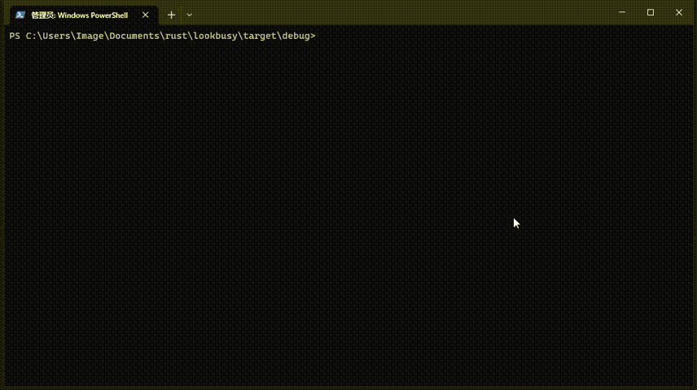

<!--
 * @Author: Image image@by.cx
 * @Date: 2022-12-05 22:39:47
 * @LastEditors: Image image@by.cx
 * @LastEditTime: 2022-12-07 22:20:16
 * @FilePath: /lookbusy-rs/README.MD
 * @Description: 
 * 
 * Copyright (c) 2022 by Image image@by.cx, All Rights Reserved. 
-->
# Lookbusy - make your PC busy

[crates.io](https://crates.io/crates/lookbusy)

This is a program can be set to eat you cpu and memory resource.

You can controll how much cpu usage per single thread.


# Install
```
cargo install lookbusy
```
# How to use
```shell
USAGE:
    lookbusy [OPTIONS]

OPTIONS:
    -c, --cpu-num <CPU_NUM>      how many cpu thread you want use [default: 1]
    -h, --help                   Print help information
    -l, --limit <LIMIT>          cpu usage per thread % [default: 1]
    -m, --mem-size <MEM_SIZE>    how many MB you want use [default: 1024]
    -V, --version                Print version information
```

Just like `./lookbusy -c 2 -m 4096`